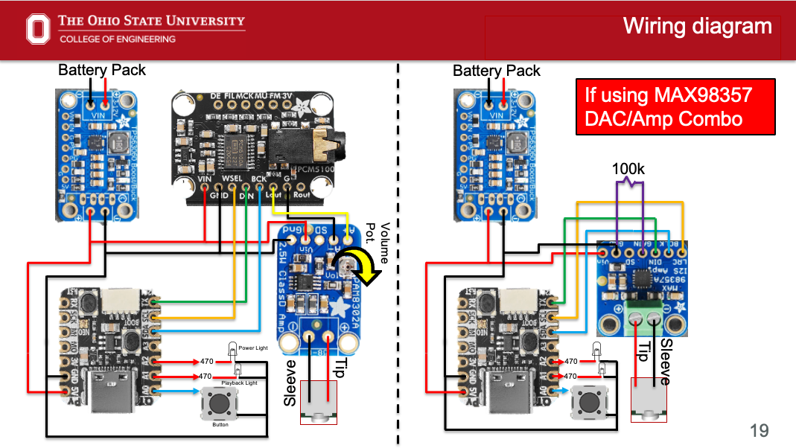
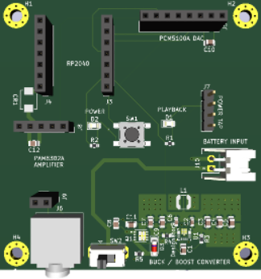
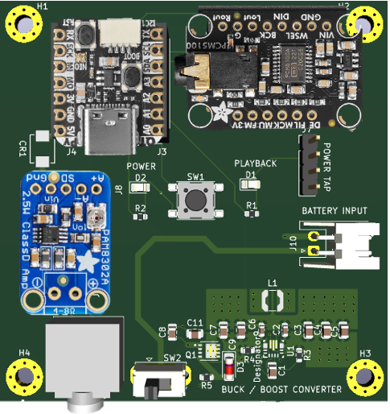
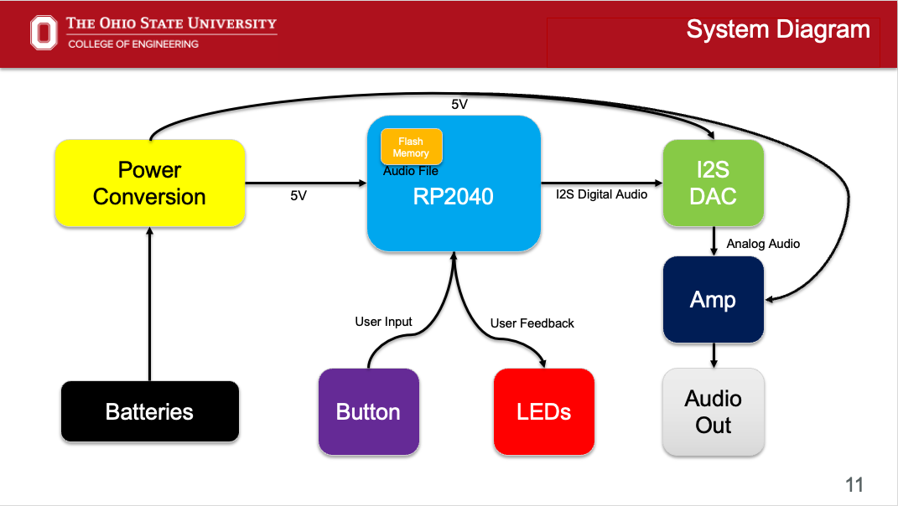
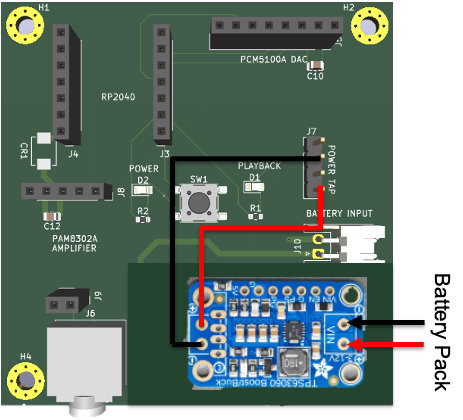

# CapstoneAudioSource
 Audio Source Project for Engineering Outreach Program (Dr. Betty Lise Anderson) at Ohio State 
 ECE 3906/4905 SP25 - AU25
 Professor: Mark Andrews
 Team Members: Charan Nanduri, D'Andre Williams, Adnan Abdullah
  for any quesitons regarding the project please email: nanduri.9@osu.edu or charan.n@me.com

# User Guide
# An RP2040 based, AA Battery Powered Audio Player

This repository contains the hardware (PCB, Schematic, CAD files) and firmware for a small, battery powered audio player based on an RP2040 board (QtPy 2040 or Seeeduino Xiao RP2040, or any pin-compatible board), a PCM5100A I²S DAC, and a PAM8302A Amplifier (or MAX98357A DAC / Amp combo).

It is intended for use with the Paper Speaker project found here: https://u.osu.edu/anderson-67/outreach/speaker/

## Parts List & Purchase Links

Below are all components required for the project.  
You may **either** purchase the DAC and amplifier separately **or** use the combined MAX98357A DAC/Amp board.

### Microcontroller
- **QtPy RP2040**  
  https://www.adafruit.com/product/4900

### Option 1: Separate DAC + Amplifier
- **PCM5100A DAC**  
  https://www.adafruit.com/product/6251  
- **PAM8302A 4Ω Audio Amplifier**  
  https://www.adafruit.com/product/2130

### Option 2: Combined DAC + Amplifier
- **MAX98357A DAC / Amplifier Combo**  
  https://www.adafruit.com/product/3006

### Additional Components
- **3.5mm Audio Jack (SJ1-3523N)**  
  https://www.digikey.com/en/products/detail/same-sky-formerly-cui-devices/SJ1-3523N/738689  
- **VERTER 5V Buck-Boost Regulator**  
  https://www.adafruit.com/product/2190  
- **4×AA Battery Pack (with On/Off Switch)**  
  https://www.adafruit.com/product/830

---

The custom PCB breaks everything out and adds:

- On-board buck/boost converter for 4x AA battery power input
- Headers for the RP2040 board, DAC, and amplifier
- JST battery input connector
- 3.5 mm jack for audio output
- Power indicator LED and playback status LED
- Single pushbutton to start/stop playback

> **Current firmware:** single button toggles audio on and off.  
> - LED on **A2** = power indicator (on whenever the board is powered)  
> - LED on **A1** = flashes while audio is playing  

---

## Repository layout

- `code_qtpy2040.py` – CircuitPython firmware for the **Adafruit QtPy RP2040**
- `code_xiao2040.py` – CircuitPython firmware for the **Seeeduino Xiao RP2040**
- `audio.wav` – example audio file
- `images/` – images and diagrams
- `hardware/` – KiCad/Fusion design files

**When deploying to the board, please rename the appropriate firmware file to **`code.py`**.**

---

## 1. Software setup (CircuitPython + Thonny)

### 1.1 Install CircuitPython on your RP2040 board

Follow these steps for **either** the QtPy 2040 or the Xiao RP2040.

1. **Download CircuitPython UF2**
   - Go to the board’s download page (Adafruit for QtPy, Seeed for Xiao).
   - Download the latest **CircuitPython UF2** for your board.
   - For Xiao Board download CircuitPython u2f here: https://circuitpython.org/board/seeeduino_xiao_rp2040/
   - For QtPy Board download Circuit Python u2f here: https://circuitpython.org/board/adafruit_qtpy_rp2040/

2. **Put the board in bootloader mode**
   - Unplug USB.
   - Hold the **BOOT/BOOTSEL** button on the RP2040 board.
   - While holding the button, plug in USB.
   - Release the button once a new drive appears on your computer named **`RPI-RP2`** (or similar).

3. **Copy CircuitPython onto the board**
   - Drag-and-drop the downloaded `*.uf2` file onto the `RPI-RP2` drive.
   - The drive will disappear and re-mount as **`CIRCUITPY`**.  
     This means CircuitPython is now installed.
---
 **More instructions** can be found here for Xiao Board: https://wiki.seeedstudio.com/XIAO-RP2040-with-CircuitPython/
 And here for QtPy Board: https://learn.adafruit.com/adafruit-qt-py-2040/circuitpython
  **You only need to do this once per board.**

### 1.2 Prepare the CIRCUITPY drive

1. **Copy this project’s files**
   - Choose the right firmware for your board from this github and download it:
     - QtPy 2040 → `code_qtpy2040.py`
     - Xiao RP2040 → `code_xiao2040.py`
	 - While the RP2040 board is still plugged in, go in File Explorer and navigate to the CIRCUITPY device.
   - Copy your chosen file to the `CIRCUITPY` drive and rename it to **`code.py`**.
   - Copy your audio file:
     - Default firmware expects a file named **`audio.wav`** in the root of `CIRCUITPY`.
     - Use 16-bit PCM WAV (mono or stereo) for best compatibility.
   - (Optional) If you want to use MP3 instead of WAV:
     - Copy your MP3 (for example `audio1.mp3`) to `CIRCUITPY`.
     - In `code.py`, comment out the `audio.wav` line and uncomment the `audiomp3.MP3Decoder` line.

Every time you change `code.py`, the board will auto-reload and run the new version.

---

### 1.3 Editing and uploading code with Thonny

This project assumes you use **Thonny** for editing and debugging CircuitPython code.

1. **Install Thonny**
   - Download and install Thonny from its official site for your OS.
   - https://thonny.org

2. **Configure the interpreter**
   - Open Thonny.
   - Go to **Run → Select interpreter…**
   - Choose **“CircuitPython (generic)”**
   - Make sure your RP2040 board (QtPy or Xiao) is connected via USB.

3. **Open and save code on the board**
   - In Thonny, use **File → Open… → This computer** to open `code_qtpy2040.py` or `code_xiao2040.py` from your repo.
   - Adjust anything you’d like (e.g., which file to play, LED behavior).
   - Use **File → Save as… → MicroPython device / CircuitPython device** and save as **`code.py`** to the `CIRCUITPY` drive.
   - Press the Green Play button to execute code on the device, and the Red Stop button to stop code execution on the device.

4. **Use the Thonny Shell for debug output**
   - The firmware prints messages (e.g., when the button is pressed).
   - Open the **Shell** at the bottom of Thonny to see printouts while the board runs.

---

## 2. Hardware setup

If you would like to forgo the PCB and make the device on a perf board the wiring diagram is here:

For the PCB:
 

### 2.1 Plugging in the RP2040 board

1. Locate the **RP2040 header footprint** in the top-left region labeled `RP2040`.
2. Carefully plug in your **QtPy 2040** or **Xiao RP2040**:
   - Align the pins so that the USB connector faces outward toward the board edge (matching the silkscreen outline).
   - Make sure all pins are fully seated and not offset by a row.

The firmware expects the following logical pins on the RP2040:

- **I²S clock pins**
  - `board.SCL` → Word select / LRCLK
  - `board.SDA` → Bit clock / BCLK
- **I²S data**
  - `board.TX`  → I²S data (DIN on DAC)
- **Button**
  - `board.A0`  → playback button input (active-low with pull-up)
- **LEDs**
  - `board.A1` → flashing playback LED
  - `board.A2` → power LED (solid on when powered)

These names match the pin definitions in the provided firmware for each board.

---

### 2.2 Connecting the PCM5100A DAC

1. Find the header labeled **`PCM5100A DAC`** near the top edge (H2).
2. Plug the PCM5100A breakout into this header, aligning:
   - **VIN / 5V**
   - **GND**
   - **LCK / LRCLK**
   - **BCK / BCLK**
   - **DIN / DATA**
3. Double-check orientation against the silkscreen and the breakout’s pin labels.

The I²S pins from the RP2040 are already wired on the PCB to this DAC header.

---

### 2.3 Connecting the PAM8302A amplifier and speaker

1. Locate the header labeled **`PAM8302A AMPLIFIER`** (J3).
2. Plug the PAM8302A breakout into this header, matching:
   - **VCC**
   - **GND**
   - **AIN+ / AIN** (audio in from DAC)
   - **AIN−** (audio ground from DAC)
3. Connect your speaker:
   - Use the speaker screw terminals or header on the PAM8302A board **or**
   - Use the on-board 3.5 mm jack / speaker header (J6) if populated.

Keep speaker impedance and power handling within the amplifier’s specs.

---

### 2.4 Battery input and power

1. Attach your battery pack to the **`BATTERY INPUT`** JST connector:
   - Designed for small DC sources (e.g. **3–4× AA cells** in series).
   - Observe polarity: **+** and **–** must match the silkscreen.

2. The on-board **buck/boost converter** section (labeled `BUCK / BOOST CONVERTER`) regulates the battery voltage for the RP2040, DAC, and amplifier.

3. Use the **power slide switch** (`SW2` near the converter) to turn the system on or off:
   - **ON** – converter enabled, RP2040 and LEDs power up.
   - **OFF** – everything is unpowered.
**NOTE** Depending on the battery pack you choose, the pack itself may have a power switch.**

4. When the board is on, the **POWER LED** (near the pushbutton) and the LED on `A2` should be lit solid.

For boards with faulty / non working buck boosts werecommend using the VERTER 5V buck boost from Adafruit.
This will require a on / off switch on the battery holder. Wire the battery to VIN on the board and wire the output to VOUT and GND on the Power tap of the PCB.

---

### 2.5 Playback button and status LEDs

The central pushbutton `SW1` is your **play/pause** control.

- **POWER LED (A2 / “POWER” silkscreen)**  
  - On whenever the board is powered.

- **PLAYBACK LED (A1 / “PLAYBACK” silkscreen)**  
  - Off when no audio is playing.  
  - Flashes while the audio track is playing.

The behavior matches the firmware:

- Button on `A0` is **active-low** with an internal pull-up.
- A short press toggles between **play** and **stop**.
- The code includes simple software debouncing and waits for the button to be released before accepting another press.

---

## 3. Using the audio player

Unplug the battery from the device. before plugging in the USB.
PLug in a usb-c data cable to the RP2040, and to your computer.
The RP2040 device will mount as a drive called CIRCUITPY.

1. **Load your audio**
   - Copy `audio.wav` (or your own WAV/MP3 as configured) to the root of the `CIRCUITPY` drive.
   - Confirm `code.py` is present and saved.

2. **Assemble the hardware**
   - RP2040 board seated correctly.
   - PCM5100A DAC and PAM8302A amplifier plugged into their headers.
   - Speaker connected.
   - Battery pack plugged into the `BATTERY INPUT` connector.

3. **Power on**
   - Flip the power switch (`SW2`) to ON.
   - POWER LED should light up.

4. **Start playback**
   - Press and release the button (`SW1`).
   - The RP2040 starts playing `audio.wav` via the DAC and amplifier.
   - The PLAYBACK LED flashes while the file is playing.

5. **Stop playback**
   - Press and release the button again.
   - Audio stops and the flashing LED turns off.

The audio file loops from the beginning each time you start playback.

---

## 4. Connection diagrams and photos

- **System-level connection diagram**

